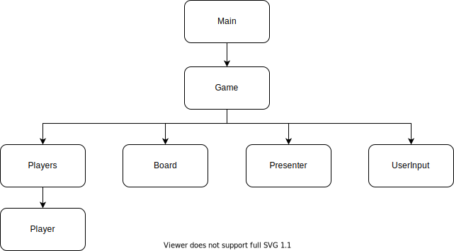

# Top Down TDD

Example of top-down style (London school) TDD

# About project

## Goal

Implement a simple **Tic Tac Toe** game

<br>

## Components



## All components except `main.go` implement the corresponding interface (see ./abstractions) folder.

<br>

### `main.go`

Controls game.

1. start a game
2. while the game is not over, ask user inputs and update the board
3. when game is over, show a message.

### `Game`

This component uses all other components

functionalities:

- ask player names
- ask user inputs (set mark to arbitrary position)
- check if the game is over
- show board

### `Board`

functionalities:

- register user input (mark and position)
- check if game is over
- get a winner ("o", "x", or "" when there is not winner)

### `Players`

functionalities:

- register player (accepts player name)
- get current player
- alternate current player when turn switches
- get player by mark ("o" or "x")

### `Presenter`

functionalities:

- shows message (in the console, in this implementation)

### `UserInput`

functionalities:

- ask user input (from the console, in this implementation)

<br>

# What is top down TDD?

Starting from the highest level of the components (`main.go` in this case), you test interactions between components by using mocks. Unlike traditional TDD, where you have a `red` - `green` - `refactor` cycle, you have `red` - `red` - ... - `red` - green cycle.

For example of `main.go`,

```
// if game is over, show message

gameMock := mocks.NewMockGame(mockCtrl)
gameMock.EXPECT().InitGame()
gameMock.EXPECT().IsOver().Return(true)
gameMock.EXPECT().ShowResultMessage()

subject(gameMock)
```

You write a test above first, then implement `Game`.

1. (red) you get an error something like mocks is not defined
2. (red) you create a mock for `Game`
3. (red) you get an error like `IsOver` method is not implemented
4. (red) you create a method `IsOver` in the mock
5. ...repeat...
6. (red) you create a method `ShowResultMessage` in the mock
7. (red) now you get an error `InitGame` is not called
8. (red) you call InitGame in the `main.go` file
9. (red) you get error like `IsOver` is not called
10. ...repeat...
11. (green) implementation is correctly done

<br> 
 
# Why top down?
When designing an application, it's natural for me to start from high level since I don't know yet how the lowest level behaves. Top down TDD would match how I design.

<br>

# How to play the game

run `go run ./main.go`

<br> 
 
 
# How to run the tests

run `go test ./...`
